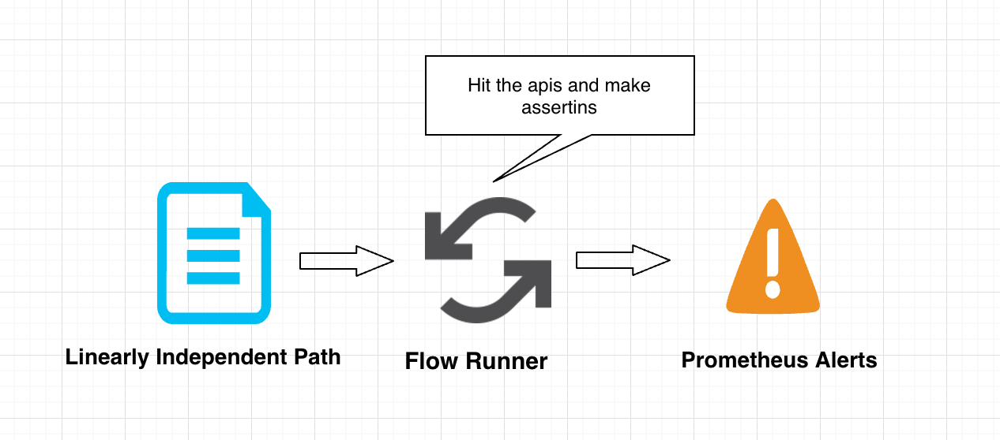

## Kscope(Kubescope)
An open system to monitor and test your apis running inside and outside of a kubernetes cluster.

### Introduction
With kubernetes being the de-facto for container orchestration, more and more services are enclosed within the kubernetes system. Only the front facing api are exposed and 
most the other apis are accessed within the internal systems. And it makes total sense to access those services directly using the kubernetes service (eg. `svc-name.svc.cluster.local`) instead of going via the Internet.

Runscope and assertible.com do a nice job moniting and checking the journeys of your APIs. But how do we check the services residing completely within the kubernetes scope? Well Kubescope is created to handle exactly that. 
With more and more APIs running withing kubernetes (only handful of services are edge services) testing and monitoring these APIs is important.

